# Goal - $i^{th}$ : The Meal Planner

Goal - $i^{th}$ is a Python-based tool that uses linear programming to create personalized, cost-effective meal plans while meeting specific nutritional requirements. It takes into account both macronutrients (proteins, carbohydrates, fats) and micronutrients (vitamins, minerals) to ensure a balanced diet tailored to your age, gender, and health goals.

## 🛠️ System Architecture

```mermaid
graph TB
    User((User))

    subgraph "Frontend Container"
        WebApp["Web Application<br>React + Vite"]

        subgraph "Core Components"
            AppComponent["App Component<br>React"]
            LandingPage["Landing Page<br>React"]
            PersonalForm["Personal Info Form<br>React + React Hook Form"]
            FoodSearchComp["Food Search<br>React"]
            ResultsComp["Results Display<br>React"]
        end

        subgraph "UI Components"
            ThemeToggle["Theme Toggle<br>React"]
            Navigation["Navigation Menu<br>React"]
            Forms["Form Controls<br>Shadcn/ui"]
            Alerts["Alert System<br>Shadcn/ui"]
        end

        subgraph "Service Layer"
            APIService["API Service<br>JavaScript"]
            ConfigService["Config Service<br>JavaScript"]
        end
    end

    subgraph "Backend Container"
        FlaskServer["API Server<br>Flask + CORS"]

        subgraph "API Endpoints"
            SearchEndpoint["Food Search API<br>Flask Route"]
            CalcEndpoint["Calculation API<br>Flask Route"]
            OptimizeEndpoint["Optimization API<br>Flask Route"]
        end

        subgraph "Core Services"
            NutrientCalc["Nutrient Calculator<br>Python"]
            DietOptimizer["Diet Optimizer<br>SciPy"]
            DataProcessor["Data Processor<br>Pandas"]
        end

        subgraph "Data Sources"
            NutrientDB["Nutrient Database<br>CSV Files"]
            USDAAPI["USDA Food Database<br>External API"]
        end
    end

    %% Container Level Relationships
    User -->|"Interacts with"| WebApp
    WebApp -->|"Makes API calls"| FlaskServer
    FlaskServer -->|"Queries"| USDAAPI
    FlaskServer -->|"Reads"| NutrientDB

    %% Frontend Component Relationships
    AppComponent -->|"Renders"| LandingPage
    AppComponent -->|"Renders"| PersonalForm
    AppComponent -->|"Renders"| FoodSearchComp
    AppComponent -->|"Renders"| ResultsComp
    AppComponent -->|"Uses"| Navigation
    AppComponent -->|"Uses"| ThemeToggle
    AppComponent -->|"Uses"| Alerts
    PersonalForm -->|"Uses"| Forms
    FoodSearchComp -->|"Uses"| Forms
    APIService -->|"Uses"| ConfigService
    AppComponent -->|"Uses"| APIService

    %% Backend Component Relationships
    SearchEndpoint -->|"Uses"| DataProcessor
    CalcEndpoint -->|"Uses"| NutrientCalc
    OptimizeEndpoint -->|"Uses"| DietOptimizer
    NutrientCalc -->|"Uses"| DataProcessor
    DietOptimizer -->|"Uses"| DataProcessor
    DataProcessor -->|"Reads"| NutrientDB
    SearchEndpoint -->|"Queries"| USDAAPI

    classDef container fill:#326ce5,stroke:#fff,stroke-width:2px,color:#fff
    classDef component fill:#fff,stroke:#326ce5,stroke-width:2px,color:#326ce5

    class WebApp,FlaskServer container
    class AppComponent,LandingPage,PersonalForm,FoodSearchComp,ResultsComp,ThemeToggle,Navigation,Forms,Alerts,APIService,ConfigService,SearchEndpoint,CalcEndpoint,OptimizeEndpoint,NutrientCalc,DietOptimizer,DataProcessor,NutrientDB,USDAAPI component
```

## 📂 Project Structure

- 📄 `.gitattributes`
- 📄 `.gitignore`
- 📄 `.python-version`
- 📄 `Dockerfile`
- 📄 `setup.cfg`
- 📄 `README.md`
- 📄 `requirements.txt`
- 📄 `heroku.yml`
- 📁 **client**
  - 📄 `index.html`
  - 📄 `eslint.config.js`
  - 📄 `postcss.config.js`
  - 📄 `tailwind.config.js`
  - 📄 `vite.config.js`
  - 📄 `package-lock.json`
  - 📄 `package.json`
  - 📄 `README.md`
  - 📁 **public**
    - 📄 `sample.csv`
    - 📄 `background-video.mp4`
  - 📁 **src**
    - 📄 `App.css`
    - 📄 `index.css`
    - 📄 `config.js`
    - 📄 `App.jsx`
    - 📄 `main.jsx`
    - 📁 **assets**
      - 📄 `react.svg`
    - 📁 **components**
      - 📄 `ActivitySlider.jsx`
      - 📄 `CalculationResults.jsx`
      - 📄 `CalorieTargetSlider.jsx`
      - 📄 `ExportHandler.jsx`
      - 📄 `FoodSearch.jsx`
      - 📄 `GitHubIcon.jsx`
      - 📄 `LandingPage.jsx`
      - 📄 `MacroRatioValidator.jsx`
      - 📄 `NutrientDisplay.jsx`
      - 📄 `NutrientInfoPopup.jsx`
      - 📄 `OptimizationResults.jsx`
      - 📄 `PersonalInfoForm.jsx`
      - 📄 `SelectedFoods.jsx`
      - 📄 `ThemeToggle.jsx`
      - 📁 **ui**
        - 📄 `badge-variants.js`
        - 📄 `alert.jsx`
        - 📄 `badge.jsx`
        - 📄 `button.jsx`
        - 📄 `card.jsx`
        - 📄 `dialog.jsx`
        - 📄 `input.jsx`
        - 📄 `label.jsx`
        - 📄 `navigation-menu.jsx`
        - 📄 `scroll-area.jsx`
        - 📄 `select.jsx`
        - 📄 `table.jsx`
        - 📄 `tabs.jsx`
        - 📄 `tooltip.jsx`
    - 📁 **services**
      - 📄 `api.js`
- 📁 **server**
  - 📄 `__init__.py`
  - 📄 `app.py`
  - 📄 `utils.py`
  - 📁 **nutrient-databases**
    - 📄 `AMDRs.csv`
    - 📄 `elements-RDAs.csv`
    - 📄 `elements-ULs.csv`
    - 📄 `macros-RDAs.csv`
    - 📄 `vitamins-RDAs.csv`
    - 📄 `vitamins-ULs.csv`
- 📁 **tests**
  - 📄 `conftest.py`
  - 📄 `setup_tests.py`
  - 📄 `test_api.py`
  - 📄 `test_grid_search.py`
  - 📄 `test_integration.py`
  - 📄 `test_utils.py`

Visualize the repo structure here: https://mango-dune-07a8b7110.1.azurestaticapps.net/?repo=ArmaanjeetSandhu%2Fgoal-ith
