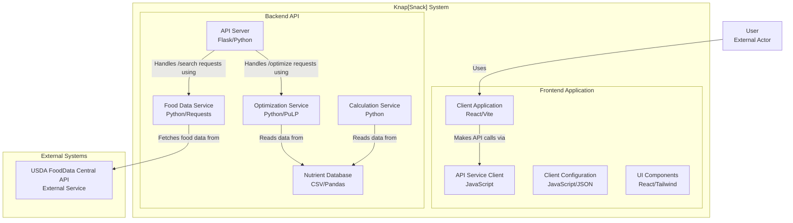

# Knap[Snack] : The Meal Planner

Knap[Snack] is a Python-based tool that uses mixed-integer linear programming to help you create personalized, cost-effective meal plans while meeting specific nutritional requirements. It takes into account macronutrients (proteins, carbohydrates, fats), micronutrients (vitamins, minerals), and water to ensure a balanced diet tailored to your age, gender, and health goals.

## 🛠️ System Architecture

Visualize the repo structure [here](https://mango-dune-07a8b7110.1.azurestaticapps.net/?repo=ArmaanjeetSandhu%2Fknapsnack).
